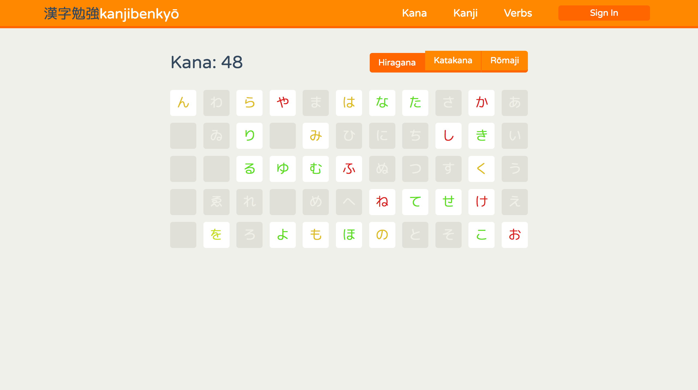
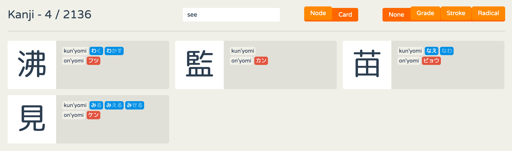
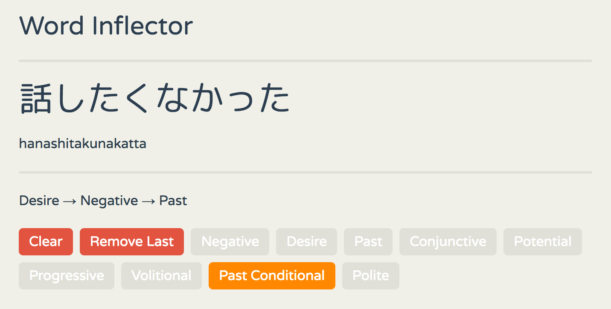

A re-implementation of
[kanjibenkyō](https://github.com/zerovolts/kanjibenkyo) using Elm &
Haskell/Rust rather than JS & Ruby.

## Kana Grid (with header)

## Kanji List

## Interactive Verb Inflector

